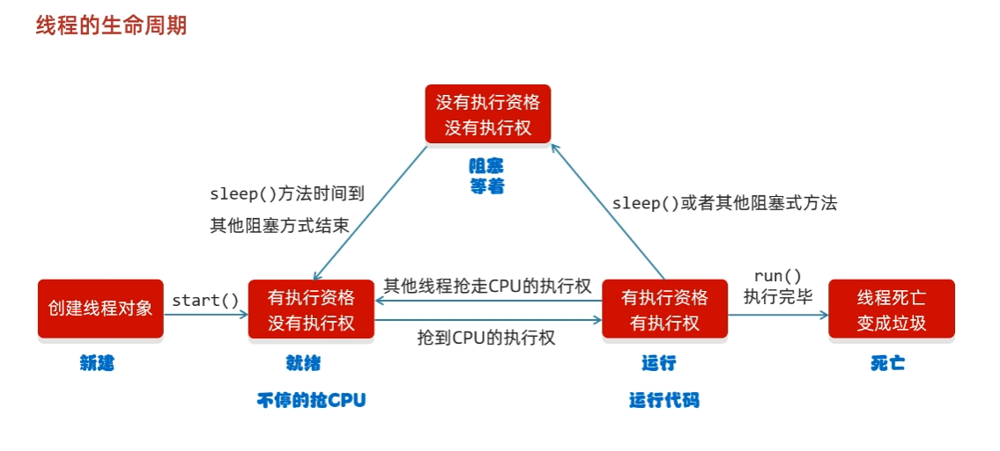
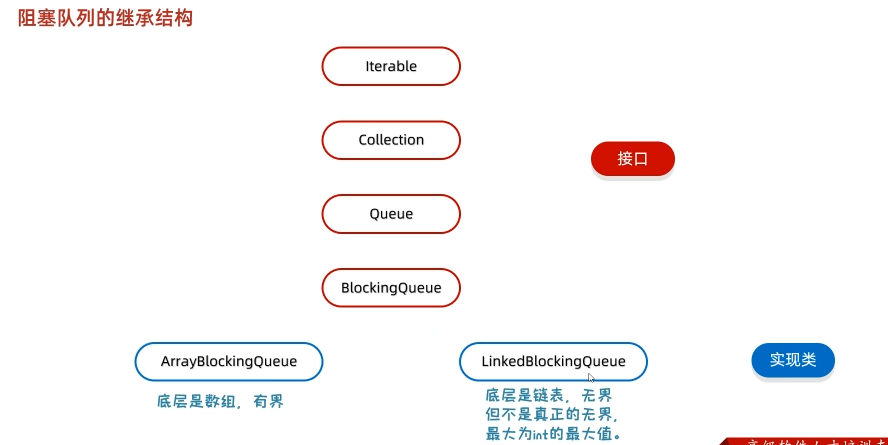
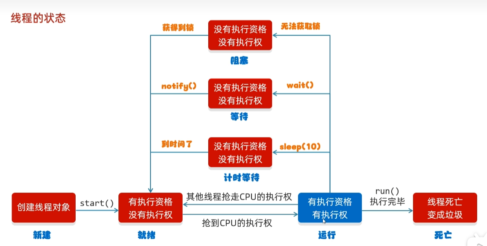

# Java-Thread
#### 介绍
# java多线程的两个概念
*并发：在同一个时刻，有多个指令在*单个*cpu上*交替*执行<br>
*并行：在同一个时刻，有多个指令在*多个*cpu上*同时*执行<br>
# 多线程的实现方式
## 继承 Thread 类的方式进行实现
        对应代码包名：method01
```java
public class ThreadDemo {
    public static void main(String[] args) {
        /**
         * 多线程的第一种启动方式
         *  1. 自己定义一个类继承 Thread
         *  2. 重写 run 方法
         *  3. 创建子类的对象，并启动线程
         */
        MyThread t1 = new MyThread();
        MyThread t2 = new MyThread();
        t1.setName("线程1");
        t2.setName("线程2");
        t1.start();
        t2.start();
    }
}

public class MyThread extends Thread{

    @Override
    public void run() {
        // 线程要执行的代码
        for (int i = 0; i < 100; i++){
            System.out.println(getName()+"hello");
        }
    }
}
```
## 实现 Runnable 接口的方式进行实现
        对应代码包名：method02
```java
public class Thread02Demo {
    public static void main(String[] args) {
        /**
         * 多线程的第二种启动方式
         * 1. 自己定义一个类实现 Runnable 接口
         * 2。 重写里面的 run 方法
         * 3. 创建自己的类的对象
         * 4. 创建一个 Thread 类的对象，并开启线程
         */

        // 创建 MyRun 的对象
        // 表示多线程要执行的任务
        MyRun r = new MyRun();
        // 创建线程对象
        Thread t1  = new Thread(r);
        Thread t2  = new Thread(r);
        t1.setName("线程1");
        t2.setName("线程2");
        // 开启线程
        t1.start();
        t2.start();
    }
}


public class MyRun implements Runnable {

    @Override
    public void run() {
        // 书写线程要执行的代码
        for (int i = 0; i < 100; i++){
            System.out.println(Thread.currentThread().getName()+"hello");
        }
    }
}
```
## 利用 Callable 接口和 Future 接口的方式实现
        对应代码包名：method03
```java
public class Thread03Demo {
    public static void main(String[] args) throws ExecutionException, InterruptedException {
        /**
         * 多线程的第三种实现方法
         *  特点：可以获取到多线程运行的结果
         *  1.创建一个 MyCallable 实现 Callable 接口
         *  2.重写 call（是有返回值的，表示多线程运行的结果）
         *  3.创建 MyCallable 的对象（表示多线程要执行的任务）
         *  4。创建 Future 的对象（作用管理多线程运行的结果）
         *  5.创建 Thread 类的对象，并启动（表示线程）
         */

        // 创建 MyCallable 的对象（表示多线程要执行的任务）
        MyCallable mc = new MyCallable();
        // 创建 FutureTask 的对象(作用管理多线程运行的结果)
        FutureTask<Integer> ft = new FutureTask<>(mc);
        // 创建线程的对象
        Thread t1 = new Thread(ft);
        // 启动线程
        t1.start();
        // 获取多线程的运行的结果
        Integer integer = ft.get();
        System.out.println(integer);
    }
}


public class MyCallable implements Callable<Integer> {
    @Override
    public Integer call() throws Exception {
        // 求 1 ~ 100 之间的和
        int sum = 0;
        for (int i = 1; i <= 100; i++){
            sum += i;
        }
        return sum;
    }
}
```
# 多线程三种实现方式对比

|                 |            优点                     |          缺点                     | 对应包名|
|             --- |                ---                 |               ---                | ---|
|继承 Thread 类    |编程比较简单，可以直接使用 Thread 类中的方法|可以扩展性较差，不能再继承其他的类|method01|
|实现 Runnable 接口|扩展性强，实现该接口的同时还可以继承其他的类|编程相对复杂，不能直接使用 Thread 类中的方法|method02|
|实现 Callable 接口|扩展性强，实现该接口的同时还可以继承其他的类|编程相对复杂，不能直接使用 Thread 类中的方法|method03|

#常见的成员方法

|         方法名称                  |       说明      |对应包名|
|           ---                   |      ---        | --- |
|String getName()                 |返回此线程的名称   |methodTest|
|void setName()                   |设置线程的名字(构造方法也可以设置名字)|methodTest|
|static Thread currentThread()    |获取当前线程的对象|methodTest|
|static void sleep(long time)     |让线程休眠指定的时间，单位为毫秒|methodTest01|
|setPriority(int newPriority)     |设置线程的优先级(1~10档，1最小，10最大，默认5) |methodTest02|
|final int getPriority()          |获取线程的优先级|methodTest02|
|final void setDaemon(boolean on) |设置为守护线程(备胎线程)|methodTest03|
|public static void yield()       |出让线程/礼让线程|methodTest04|
|public static void join()        |插入线程/插队线程|methodTest05|

# 线程的生命周期


# 线程安全的问题
## 同步代码块
    把操作共享数据的代码锁起来
```java
// 格式
synchronized(锁对象){
    操作共享数据的代码
        }
/*
        特点一： 锁默认打开，有一个线程进去了，锁自动关闭
        特点二： 里面的代码全部执行完毕，线程出来，锁自动打开
 */
```
        需求：某电影院目前正在上映国产大片，共有100张票，而它有3个窗口卖票，请设计一个程序模拟该电影院卖票[包名：test01]
```java
public class ThreadDemo {
    public static void main(String[] args) {
        /*
        某电影院目前正在上映国产大片，共有100张票，而它有3个窗口卖票，请设计一个程序模拟该电影院卖票
         */
        // 创建对象
        MyThread t1 = new MyThread();
        MyThread t2 = new MyThread();
        MyThread t3 = new MyThread();

        // 起名字
        t1.setName("窗口1");
        t2.setName("窗口2");
        t3.setName("窗口3");

        // 开启线程
        t1.start();
        t2.start();
        t3.start();
    }
}


public class MyThread extends Thread{

    // 表示这个类所有的对象，都共享 ticket数据
    static int ticket = 0; // 0 ~ 99

    // 锁对象，一定要是唯一的
//    static Object obj = new Object();

    @Override
    public void run() {
        while (true){
            // 加锁 轮流执行(同步代码块)
            // MyThread.class类的字节码文件表示唯一
            synchronized (MyThread.class){
                if (ticket < 100){
                    try {
                        Thread.sleep(10);
                    } catch (InterruptedException e) {
                        e.printStackTrace();
                    }
                    ticket ++;
                    System.out.println(getName() + "正在卖第" + ticket + "张票");
                } else {
                    break;
                }
            }
        }
    }
}

```
## 同步方法
    就是把 synchronized 关键字加到方法上
```java
// 格式 
修饰符 synchronized 返回值类型 方法名(方法参数){...}
// 特点1：同步方法是锁住方法里面所有的代码
// 特点2：锁对象不能自己指定  非静态：this  静态：当前类的字节码文件对象
```
例子：某电影院目前正在上映国产大片，共有180张票，而它有3个窗口卖票，请设计一个程序模拟该电影院卖票
利用同步方法完成
```java
public class ThreadDemo {
    public static void main(String[] args) {
        /*
        某电影院目前正在上映国产大片，共有180张票，而它有3个窗口卖票，请设计一个程序模拟该电影院卖票
        利用同步方法完成
         */

        MyRunnable mr = new MyRunnable();

        Thread t1 = new Thread(mr);
        Thread t2 = new Thread(mr);
        Thread t3 = new Thread(mr);

        t1.setName("窗口1");
        t2.setName("窗口2");
        t3.setName("窗口3");
        t1.start();
        t2.start();
        t3.start();
        
    }
}

public class MyRunnable implements Runnable{

    int ticket = 0;

    @Override
    public void run() {
        // 循环
        // 同步代码块
        // 判断共享数据是否到了末尾，如果到了末尾
        // 判断共享数据是否到了末尾，如果没有到末尾
        while (true){
            synchronized (MyRunnable.class) {
                if (method()) break;
            }
        }
    }

    // 锁对象 非静态是 this
    private synchronized boolean method() {
        if (ticket == 100){
            return true;
        }else {
            try {
                Thread.sleep(10);
            } catch (InterruptedException e) {
                e.printStackTrace();
            }
            ticket++;
            System.out.println(Thread.currentThread().getName() + "在卖第" + ticket);
        }
        return false;
    }
}
```


# Lock锁
        代码包test03
  虽然我们可以理解同步代码块和同步方法的锁对象问题但是我们并没有直接看到在哪里加上了锁，在哪里释放了锁提供了一个新的锁对象Lock为了更清晰的表达如何加锁和释放锁，
JDK5以后提供了一个新的锁对象Lock。

  Lock实现提供比使用方法和语句可以获得更广泛的锁定操作synchronized方法和语句可以获得更广泛的锁定操作。
  Lock中提供了获得锁和释放锁的方法
  void lock(): 获得锁
  void unlock():释放锁

  Lock是接口不能直接实例化，这里采用它的实现类ReentrantLock来实例化
  ReentrantLock的构造方法
  ReentrantLock():创建一个ReentrantLock的实例
```java
public class ThreadDemo {
    public static void main(String[] args) {
        /*
        某电影院目前正在上映国产大片，共有180张票，而它有3个窗口卖票，请设计一个程序模拟该电影院卖票
        使用JDK的lock实现
         */
        MyThread t1 = new MyThread();
        MyThread t2 = new MyThread();
        MyThread t3 = new MyThread();

        t1.setName("窗口1");
        t2.setName("窗口2");
        t3.setName("窗口3");

        t1.start();
        t2.start();
        t3.start();
    }
}

public class MyThread extends Thread {

  static int ticket = 0;
  // 创建锁对象
  static Lock lock = new ReentrantLock();

  @Override
  public void run() {
    while (true) {
      // 加锁 轮流执行(同步代码块)
      // MyThread.class类的字节码文件表示唯一
//            synchronized (MyThread.class){
      lock.lock();// 加锁
      try {
        if (ticket == 100) {
          break;
        } else {
          Thread.sleep(10);
          ticket++;
          System.out.println(getName() + "正在卖第" + ticket + "张票");
        }
      } catch (InterruptedException e) {
        e.printStackTrace();
      } finally {
        lock.unlock();
      }
    }
  }
}
```

# 死锁
    死锁 是指两个或两个以上的进程在执行过程中，由于竞争资源或者由于彼此通信而造成的一种阻塞的现象，若无外力作用，它们都将无法推进下去。也就是两个线程拥有锁的情况下，又在尝试获取对方的锁，从而造成程序一直阻塞的情况。
    代码包test04
```java
public class ThreadDemo {
    public static void main(String[] args) {
        /*
        需求：
            死锁
         */
        MyThread t1 = new MyThread();
        MyThread t2 = new MyThread();

        t1.setName("线程A");
        t2.setName("线程B");

        t1.start();
        t2.start();
    }
}


public class MyThread extends Thread {

  static Object objA = new Object();
  static Object objB = new Object();

  @Override
  public void run() {
    // 1. 循环
    while (true) {
      if ("线程A".equals(getName())) {
        synchronized (objA) {
          System.out.println("线程A拿到了A锁，准备拿B锁");
          synchronized (objB) {
            System.out.println("线程A拿到了B锁，顺利执行完一轮");
          }
        }
      } else if ("线程B".equals(getName())) {
        if ("线程B".equals(getName())) {
          synchronized (objB) {
            System.out.println("线程B拿到了B锁，准备拿A锁");
            synchronized (objA) {
              System.out.println("线程B拿到了A锁，顺利执行完一轮");
            }
          }
        }
      }
    }
  }
}
```

# 生产者和消费者（等待唤醒机制）
    生产者等待/消费者等待
    生产者消费者模式是一个十分经典的多线程协作的模式
## 生产者和消费者（常见方法）
    代码包:test05
|   方法名称  |   说明 |
|   ---      |   --- |
| void wait() | 当前线程等待,直到被其他线程唤醒|
| void notify()| 随机唤醒单个线程|
| void notifyAll()| 唤醒所有线程|
```java
// 消费者
public class Consumer extends Thread {

  @Override
  public void run() {
        /*
        1. 循环
        2. 同步代码块
        3. 判断共享数据是否到了末尾（到了末尾）
        4. 判断共享数据是否到了末尾（没有到末尾，执行核心逻辑）
         */
    while (true) {
      synchronized (Controller.lock) {
        if (Controller.count == 0) {
          break;
        } else {
          // 先判断桌子上是否有面条
          if (Controller.foodFlag == 0) {
            // 如果没有，就等待
            try {
              Controller.lock.wait();// 让当前线程跟锁进行绑定
            } catch (InterruptedException e) {
              e.printStackTrace();
            }
          } else {
            // 把吃的总数 - 1
            Controller.count--;
            // 如果有，就开吃
            System.out.println("正在消费，还能消费" + Controller.count);
            // 吃完之后，唤醒厨师继续做
            Controller.lock.notifyAll();
            // 修改状态
            Controller.foodFlag = 0;
          }
        }
      }
    }
  }
}

// 生产者
public class Producer extends Thread{

  @Override
  public void run() {
        /*
        1. 循环
        2. 同步代码块
        3. 判断共享数据是否到了末尾（到了末尾）
        4. 判断共享数据是否到了末尾（没有到末尾，执行核心逻辑）
         */
    while (true){
      synchronized (Controller.lock){
        if (Controller.count == 0){
          break;
        }else {
          // 判断桌子上是否有食物
          if (Controller.foodFlag == 1){
            // 如果有，就等待
            try {
              Controller.lock.wait();
            } catch (InterruptedException e) {
              e.printStackTrace();
            }
          }else {
            // 如果没有，就制作食物
            System.out.println("开始制作食物");
            // 修改桌子尚的食物状态
            Controller.foodFlag = 1;
            // 侥幸等待的消费者开吃
            Controller.lock.notifyAll();
          }
        }
      }
    }
  }
}

// 控制线程
public class Controller {
    /*
    作用：
        控制生产者和消费者执行
     */

  // 判断是否有面条  0：没有面条  1：有面条
  public static int foodFlag = 0;

  // 总个数
  public static int count = 10;

  // 锁对象
  public static Object lock = new Object();

}

// main函数
public class ThreadDemo {
  public static void main(String[] args) {

        /*
        需求： 完成生产者和消费者（等待唤醒机制）的代码
              实现线程轮流交替执行的效果
         */

    // 创建线程对象
    Consumer c = new Consumer();
    Producer p = new Producer();

    // 给线程设置名字
    p.setName("生产者");
    c.setName("消费者");

    // 开启线程
    c.start();
    p.start();
  }
}
```

## 等待唤醒机制（阻塞队列方式实现）
**什么是阻塞队列**
* 阻塞队列（BlockingQueue）是一个支持两个附加操作的队列，这两个附加的操作支持阻塞的插入和移除方法。
* 支持阻塞的插入方法：当队列满时，队列会阻塞插入元素的线程，直到队列不满。
* 支持阻塞的移除方法：当队列为空时，获取元素的线程会等待队列变为非空。
* 阻塞队列常用于生产者和消费者场景，生产者是向队列里添加元素的线程，消费者是从队列里获取元素的线程。阻塞队列就是生产者用来存放元素、消费者用来获取元素的容器。
### 阻塞队列的继承结构

```java
// 消费者
public class Cookie extends Thread{

  ArrayBlockingQueue<String> queue;

  public Cookie(ArrayBlockingQueue<String> queue){
    this.queue = queue;
  }
  @Override
  public void run() {
    while (true){
      // 不断把面条放到阻塞队列当中
      try {
        queue.put("面条");
        System.out.println("厨师放了一碗面条");
      }catch (InterruptedException e){
        e.printStackTrace();
      }
    }
  }
}


// 生产者
public class Foodie extends Thread{

  ArrayBlockingQueue<String> queue;

  public Foodie(ArrayBlockingQueue<String> queue){
    this.queue = queue;
  }

  @Override
  public void run() {
    while (true){
      // 不断把面条放到阻塞队列当中
      try {
        String food = queue.take();
        System.out.println(food);
      }catch (InterruptedException e){
        e.printStackTrace();
      }
    }
  }
}


// 主函数
public class ThreadDemo {
  public static void main(String[] args) {
        /*
        需求： 利用阻塞队列完成生产者和消费者（等待唤醒机制）的代码
            细节：生产者和消费者必须使用同一个阻塞队列
         */

    // 1. 创建阻塞队列的对象
    ArrayBlockingQueue<String> queue = new ArrayBlockingQueue<>(1);

    // 2. 创建线程的对象，并把阻塞队列传递过去
    Cookie c = new Cookie(queue);
    Foodie f = new Foodie(queue);

    // 3. 开启线程
    c.start();
    f.start();
  }
}
```
# 线程状态


新建状态（NEW）  --------->  创建线程对象
就绪状态（RUNABLE）--------->  start方法
阻塞状态（BLOCKED）--------->  无法获得锁对象
等待状态（WAITING）--------->  wait方法
计时等待（TIMED_WAITING）---------> sleep方法
结束状态（TERMINATED）--------->  全部代码运行完毕

# 多线程练习
## 题一：
共有1000张电影票,可以在两个窗口领取,假设每次领取的时间为3000毫秒要求:请用多线程模拟卖票过程并打印剩余电影票的数量


## 题二：
有100份礼品,两人同时发送，当剩下的礼品小于10份的时候则不再送出利用多线程模拟该过程并将线程的名字和礼物的剩余数量打印出来.


## 题三：
同时开启两个线程，共同获取1-100之间的所有数字要求:将输出所有的奇数。


## 题四：
抢红包也用到了多线程
假设:100块，分成了3个包，现在有5个人去抢。
其中，红包是共享数据。
5个人是5条线程。
打印结果如下
XXX抢到了XXX元
XXX抢到了XXX元
XXX抢到了XXX元
XXX没抢到
XXX没抢到
```java
public class MyThread extends Thread {
    // 共享数据
    // 100块，分成三个包
    static BigDecimal money = new BigDecimal(100);
    static int count = 3;

    // 最小中奖金额
    static final BigDecimal MIN = BigDecimal.valueOf(0.01);

    @Override
    public void run() {
        synchronized (MyThread.class) {
            if (count == 0) {
                // 判断共享数据已经到末尾
                System.out.println(getName() + "未抢到红包");
            } else {
                // 判断共享数据没有到末尾
                // 定义一个变量，表示中奖的金额
                BigDecimal prize;
                if (count == 1) {
                    // 表示此时是最后一个红包
                    // 就无需随机，剩余所有的钱就是中奖金额
                    prize = money;
                } else {
                    // 获取抽奖范围
                    double bounds = money.subtract(BigDecimal.valueOf(count - 1).multiply(MIN)).doubleValue();
                    Random r = new Random();
                    // 抽奖金额
                    prize = BigDecimal.valueOf(ThreadLocalRandom.current().nextDouble(0, bounds));
                }
                // 设置抽中红包，小数点保留两位，四舍五入
                prize = prize.setScale(2, RoundingMode.HALF_UP);
                // 在总金额中去掉对应的钱
                money = money.subtract(prize);
                // 红包个数减少
                count--;
                // 输出红包信息
                System.out.println(getName() + "抽中了" + prize + "元");
            }
        }
    }
}
```

## 题五：
有一个抽奖池,该抽奖池中存放了奖励的金额,该抽奖池中的奖项为(10,5,20,50,100,200,500,800,2,80,300,700);创建两个抽奖箱(线程)设置线程名称分别为“抽奖箱1”“抽奖箱2”随机从抽奖池中获取奖项元素并打印在控制台上,格式如下
每次抽出一个奖项就打印一个(随机)
抽奖箱1又产生了一个 10 元大奖
抽奖箱1又产生了一个 100 元大奖
抽奖箱1 又产生了一个 200 元大奖
抽奖箱1 又产生了一个 800 元大奖
抽奖箱2又产生了一个700 元大奖
```java
public class Test {
    public static void main(String[] args) {
    /*
    有一个抽奖池,该抽奖池中存放了奖励的金额,该抽奖池中的奖项为(10,5,20,50,100,200,500,800,2,80,300,7001;创建两个抽奖箱(线程)设置线程名称分别为“抽奖箱1”“抽奖箱2”随机从抽奖池中获取奖项元素并打印在控制台上,格式如下
    每次抽出一个奖项就打印一个(随机)
    抽奖箱1又产生了一个 10 元大奖
    抽奖箱1又产生了一个 100 元大奖
    抽奖箱1 又产生了一个 200 元大奖
    抽奖箱1 又产生了一个 800 元大奖
    抽奖箱2又产生了一个700 元大奖
     */
        // 创建奖池
        ArrayList<Integer> list = new ArrayList<>();
        Collections.addAll(list,10,5,20,50,100,200,500,800,2,80,300,700);

        MyThread t1 = new MyThread(list);
        MyThread t2 = new MyThread(list);

        t1.setName("抽奖箱1");
        t2.setName("抽奖箱2");
        t1.start();
        t2.start();
    }
}


public class MyThread extends Thread {

  ArrayList<Integer> list;

  public MyThread(ArrayList<Integer> list) {
    this.list = list;
  }

  @Override
  public void run() {
    while (true) {
      synchronized (MyThread.class) {
        if (list.size() == 0) {
          break;
        } else {
          // 继续抽奖
          // 打乱集合顺序
          Collections.shuffle(list);
          Integer prize = list.remove(0);
          System.out.println(getName() + "又产生一个" + prize + "元大奖");
//                    Integer integer = list.get(0);
//                    list.remove(0);
        }
        try {
          Thread.sleep(10);
        } catch (InterruptedException e) {
          e.printStackTrace();
        }
      }
    }
  }
}
```

## 题六：
在上一题基础上继续完成如下需求:
每次抽的过程中，不打印，抽完时一次性打印(随机)在此次抽奖过程中，抽奖箱1总共产生了6个奖项
分别为:10,20,100,500,2,300最高奖项为300元，总计额为932元在此次抽奖过程中，抽奖箱2总共产生了6个奖项
分别为:5,50,200,800,80,700最高奖项为800元，总计额为1835元
````java
public class Test {
    public static void main(String[] args) {
          /*
    在上一题基础上继续完成如下需求:
    每次抽的过程中，不打印，抽完时一次性打印(随机)在此次抽奖过程中，抽奖箱1总共产生了6个奖项
    分别为:10,20,100,500,2,300最高奖项为300元，总计额为932元在此次抽奖过程中，抽奖箱2总共产生了6个奖项
    分别为:5,50,200,800,80,700最高奖项为800元，总计额为1835元
     */
        // 创建奖池
        ArrayList<Integer> list = new ArrayList<>();
        Collections.addAll(list,10,5,20,50,100,200,500,800,2,80,300,700);

        MyThread t1 = new MyThread(list);
        MyThread t2 = new MyThread(list);

        t1.setName("抽奖箱1");
        t2.setName("抽奖箱2");
        t1.start();
        t2.start();
    }
}

public class MyThread extends Thread{
  ArrayList<Integer> list;

  public MyThread(ArrayList<Integer> list) {
    this.list = list;
  }
  @Override
  public void run() {
    ArrayList<Integer> boxList = new ArrayList<>();
    while (true) {
      synchronized (com.test.thread.TestCase5.MyThread.class) {
        if (list.size() == 0) {
          System.out.println(getName() + boxList);
          break;
        } else {
          // 继续抽奖
          // 打乱集合顺序
          Collections.shuffle(list);
          Integer prize = list.remove(0);
          boxList.add(prize);
        }
        try {
          Thread.sleep(10);
        } catch (InterruptedException e) {
          e.printStackTrace();
        }
      }
    }
  }
}

````

## 题七：
在上一题基础上继续完成如下需求:在此次抽奖过程中，抽奖箱1总共产生了6个奖项，分别为: 10,20,100,500,2,300
最高奖项为300元，总计额为932元在此次抽奖过程中，抽奖箱2总共产生了5个奖项，分别为:5,50,200,800,80,700
最高奖项为800元，总计额为1835元在此次抽奖过程中,抽奖箱2中产生了最大奖项,该奖项金额为800元
以上打印效果只是数据模拟,实际代码运行的效果会有差异
```java
public class Test {
    public static void main(String[] args) throws ExecutionException, InterruptedException {
        /*
        在上一题基础上继续完成如下需求:在此次抽奖过程中，抽奖箱1总共产生了6个奖项，分别为: 10,20,100,500,2,300
        最高奖项为300元，总计额为932元在此次抽奖过程中，抽奖箱2总共产生了5个奖项，分别为:5,50,200,800,80,700
        最高奖项为800元，总计额为1835元在此次抽奖过程中,抽奖箱2中产生了最大奖项,该奖项金额为800元

        核心逻辑：获取线程抽奖的最大值（看成是线程运行的结果）
        以上打印效果只是数据模拟,实际代码运行的效果会有差异
         */

        // 创建奖池
        ArrayList<Integer> list = new ArrayList<>();
        Collections.addAll(list,10,5,20,50,100,200,500,800,2,80,300,700);

        // 创建多线程的要运行的参数对象
        MyCallable mc = new MyCallable(list);

        // 创建多线程运行结果的管理者对象
        FutureTask<Integer> ft1 = new FutureTask<>(mc);
        FutureTask<Integer> ft2 = new FutureTask<>(mc);

        // 创建线程对象
        Thread t1 = new Thread(ft1);
        Thread t2 = new Thread(ft2);
        t1.setName("抽奖箱1");
        t2.setName("抽奖箱2");
        t1.start();
        t2.start();
        Integer max1 = ft1.get();
        Integer max2 = ft2.get();
        System.out.println(max1);
        System.out.println(max2);

    }
}

public class MyCallable implements Callable<Integer> {
  ArrayList<Integer> list;

  public MyCallable(ArrayList<Integer> list) {
    this.list = list;
  }

  @Override
  public Integer call() throws Exception {
    ArrayList<Integer> boxList = new ArrayList<>();
    while (true) {
      synchronized (com.test.thread.TestCase5.MyThread.class) {
        if (list.size() == 0) {
          System.out.println(Thread.currentThread().getName() + boxList);
          break;
        } else {
          // 继续抽奖
          // 打乱集合顺序
          Collections.shuffle(list);
          Integer prize = list.remove(0);
          boxList.add(prize);
        }
      }
      Thread.sleep(10);
    }
    // 把集合的最大值返回
    if (boxList.size() == 0) {
      return null;
    } else {
      return Collections.max(boxList);
    }
  }
}
```

# 线程池
<b>线程池主要核心逻辑</b>
* 创建一个池子，池子中是空的
* 提交任务时，池子回创建新的线程对象，任务执行完毕，线程归还给池子
  下回再提交任务时，不需要创建新的线程，直接复用已有的线程即可。
* 但是如果提交任务时，池子中没有空闲线程，也无法创建新的线程，任务就会排队等待 

<b>线程池代码实现</b>
* 创建线程池
* 提交任务
* 所有的任务全部执行完毕，关闭线程池

Executors: 线程池的工具类通过调用方法返回不同类型的线程池对象。

|方法名称| 说明|
| --- | --- |
|public static ExecutorService newCachedThreadPool|创建一个没有上线的线程池|
|public static ExecutorService newFixedThreadPool(int nThreads)|创建有上限的线程池|
```java
public class MyThreadPoolDemo {
    public static void main(String[] args) throws InterruptedException {
        /*
        public static ExecutorService newCachedThreadPool|创建一个没有上线的线程池|
        public static ExecutorService newFixedThreadPool(int nThreads)|创建有上限的线程池|
         */

        // 1.获取线程池对象
        ExecutorService pool1 = Executors.newCachedThreadPool();

        // 2.提交任务
        pool1.submit(new MyRunnable());
        Thread.sleep(1000);
        pool1.submit(new MyRunnable());
        Thread.sleep(1000);
        pool1.submit(new MyRunnable());
        Thread.sleep(1000);
        pool1.submit(new MyRunnable());
        Thread.sleep(1000);
        pool1.submit(new MyRunnable());
        Thread.sleep(1000);
        // 3.销毁线程池
        pool1.shutdown();

        System.out.println("---xxx---");
        ExecutorService pool2 = Executors.newFixedThreadPool(3);

        // 2.提交任务
        pool2.submit(new MyRunnable());
        pool2.submit(new MyRunnable());
        pool2.submit(new MyRunnable());
        pool2.submit(new MyRunnable());
        pool2.submit(new MyRunnable());
        // 3.销毁线程池
        pool2.shutdown();
    }
}

public class MyRunnable implements Runnable{
  @Override
  public void run() {
    for (int i = 0; i < 100; i++){
      System.out.println(Thread.currentThread().getName()+"---"+i);
//            System.out.println(Thread.currentThread().getName()+"---"+"i");
    }
  }
}
```
# 自定义线程池
    核心元素：
    *核心线程数量
    *线程池中最大线程的数量
    *空闲时间(值)
    *空闲时间(单位)
    *阻塞队列
    *创建线程的方式
    *要执行的任务过多时的解决方案
## 自定义线程池（任务拒绝策略）
|任务拒绝策略|说明|
| --- | --- |
|ThreadPoolExecutor.AbortPolicy|默认策略：丢弃任务并抛出RejectedExcutionException异常|
|ThreadPoolExecutor.DiscardPolicy|丢弃任务，但是不抛出异常这是不推荐的做法|
|ThreadPoolExecutor.DiscardOldestPolicy|抛弃队列中等待最久的任务然后八当前任务加入队列中|
|ThreadPoolExecutor.CallerRunsPolicy|调用任务的run()方法绕过线程池直接执行|
```java
public class MyThreadPoolDemo1 {
    public static void main(String[] args) {
        /*
        ThreadPoolExecutor threadPoolExecutor = new ThreadPoolExecutor(核心线程数量,最大线程数量,空闲线程最大存活时间,任务队列,创建线程工厂,任务的拒绝策略);
        参数一:核心线程数量          不能小于0
        参数二:最大线程数            不能小于等于0，最大数量 >= 核心线程数量
        参数三:空闲线程最大存活时间    不能小于0
        参数四:时间单位              用TimeUnit指定
        参数五: 任务队列             不能为null
        参数六:创建线程工厂           不能为null
        参数七:任务的拒绝策略          不能为null
         */
        ThreadPoolExecutor pool = new ThreadPoolExecutor(
                3,// 核心线程数量，不能小于0
                6,//最大线程数量，不能小于0，最大数量 >= 核心线程数量
                60,// 空闲线程最大存活时间
                TimeUnit.SECONDS,// 时间单位
                new ArrayBlockingQueue<>(3),// 任务队列
                Executors.defaultThreadFactory(),// 创建线程工厂
                new ThreadPoolExecutor.AbortPolicy()//任务的拒接策略
        );
//        pool.submit()
    }
}

```